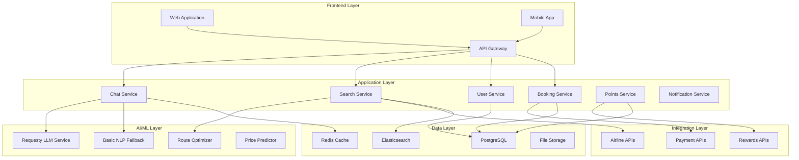

# Flight Search SaaS Design Document

## Overview

The Flight Search SaaS is designed as a cloud-native, microservices-based platform that combines conversational AI with real-time flight data to simplify points-based travel booking. The architecture prioritizes modularity, scalability, and user experience while handling complex integrations with multiple airline APIs and reward program systems.

### Key Design Principles

- **Conversational First**: Chat-like interface powered by LLM integration
- **Modular Architecture**: Microservices enabling independent feature development
- **Real-time Data**: Live flight and award space information
- **AI-Driven Optimization**: Intelligent route and points value analysis
- **Security by Design**: Encrypted storage of sensitive reward program credentials
- **Mobile-First**: Responsive design optimized for all devices

## Architecture

### High-Level System Architecture



### Technology Stack

**Frontend:**
- React.js with TypeScript for web application
- React Native for mobile applications
- Tailwind CSS for responsive design
- Socket.io for real-time chat functionality

**Backend Services:**
- Node.js with Express.js for API services
- Requesty integration for LLM services
- GraphQL for flexible data querying
- WebSocket connections for real-time updates

**AI/ML:**
- Requesty API for multi-LLM access (GPT-4, Claude, Gemini, etc.)
- Basic NLP fallback service for system reliability
- Custom ML models for route optimization
- TensorFlow/PyTorch for price prediction
- Vector databases for semantic search

**Data Storage:**
- PostgreSQL for transactional data
- Redis for caching and session management
- Elasticsearch for flight search indexing
- AWS S3 for file storage and backups

**Infrastructure:**
- Docker containers with Kubernetes orchestration
- AWS/Azure cloud platform
- CDN for global content delivery
- Load balancers for high availability

## Components and Interfaces

### 1. Chat Service

**Purpose:** Handles conversational interactions and natural language processing

**Key Features:**
- Natural language understanding for travel queries
- Context management for multi-turn conversations
- Integration with LLM services
- Response formatting and personalization

**API Endpoints:**
```typescript
POST /api/chat/message
GET /api/chat/history/:sessionId
POST /api/chat/session
DELETE /api/chat/session/:sessionId
```

**Data Flow:**
1. User sends message via WebSocket or HTTP
2. Message processed by NLU pipeline
3. Intent and entities extracted
4. Appropriate service called based on intent
5. Response formatted and returned to user

### 2. Search Service

**Purpose:** Orchestrates flight searches across multiple data sources

**Key Features:**
- Multi-airline API aggregation
- Real-time availability checking
- Route optimization algorithms
- Caching for performance

**API Endpoints:**
```typescript
POST /api/search/flights
GET /api/search/results/:searchId
POST /api/search/filter
GET /api/search/suggestions
```

**Integration Points:**
- Airline APIs (Amadeus, Sabre, direct airline APIs)
- Route optimization service
- Caching layer for frequent searches
- Price tracking and alerts

### 3. Points Service

**Purpose:** Manages reward program integrations and point valuations

**Key Features:**
- Secure credential storage for reward accounts
- Real-time points balance checking
- Transfer ratio calculations
- Award space availability tracking

**API Endpoints:**
```typescript
POST /api/points/accounts
GET /api/points/balances/:userId
POST /api/points/valuations
GET /api/points/transfer-options
```

**Security Considerations:**
- OAuth 2.0 for reward program authentication
- Encrypted storage of sensitive credentials
- Regular token refresh mechanisms
- Audit logging for all point transactions

### 4. LLM Service (Requesty Integration)

**Purpose:** Provides intelligent conversational interface using multiple LLM providers

**Key Features:**
- Multi-LLM access through single Requesty API key
- Structured output parsing for flight search intents
- Context-aware conversation management
- Fallback to basic NLP when LLM unavailable
- Cost optimization through model selection

**Architecture:**
```typescript
interface LLMService {
  generateResponse(message: string, context: ConversationContext): Promise<LLMResponse>
  extractFlightIntent(message: string): Promise<FlightSearchIntent>
  handleFallback(message: string): string
}
```

**Supported Models:**
- OpenAI GPT-4/GPT-3.5
- Anthropic Claude
- Google Gemini
- Other models via Requesty router

**Integration Flow:**
1. User message received via WebSocket/HTTP
2. LLM service processes with conversation context
3. Structured response extracted (intent, entities, response)
4. Response sent back to user
5. Fallback to basic NLP if LLM fails

### 5. Booking Service

**Purpose:** Handles flight reservations and payment processing

**Key Features:**
- Multi-step booking workflow
- Payment processing integration
- Booking confirmation and ticketing
- Cancellation and modification handling

**API Endpoints:**
```typescript
POST /api/booking/initiate
POST /api/booking/confirm
GET /api/booking/status/:bookingId
POST /api/booking/cancel
```

**Workflow:**
1. User selects flight option
2. Booking service validates availability
3. Payment processing initiated
4. Airline booking API called
5. Confirmation sent to user

### 5. User Service

**Purpose:** Manages user accounts, preferences, and authentication

**Key Features:**
- User registration and authentication
- Profile management
- Travel preferences storage
- Notification settings

**API Endpoints:**
```typescript
POST /api/users/register
POST /api/users/login
GET /api/users/profile
PUT /api/users/preferences
```

## Data Models

### User Model
```typescript
interface User {
  id: string;
  email: string;
  passwordHash: string;
  profile: UserProfile;
  preferences: TravelPreferences;
  rewardAccounts: RewardAccount[];
  createdAt: Date;
  updatedAt: Date;
}

interface UserProfile {
  firstName: string;
  lastName: string;
  phoneNumber?: string;
  dateOfBirth?: Date;
  passportNumber?: string;
}

interface TravelPreferences {
  preferredAirlines: string[];
  preferredAirports: string[];
  seatPreference: 'aisle' | 'window' | 'middle';
  mealPreference?: string;
  maxLayovers: number;
  preferredCabinClass: 'economy' | 'premium' | 'business' | 'first';
}
```

### Flight Search Model
```typescript
interface FlightSearch {
  id: string;
  userId: string;
  searchCriteria: SearchCriteria;
  results: FlightResult[];
  status: 'pending' | 'completed' | 'error';
  createdAt: Date;
  expiresAt: Date;
}

interface SearchCriteria {
  origin: string;
  destination: string;
  departureDate: Date;
  returnDate?: Date;
  passengers: PassengerCount;
  cabinClass: string;
  flexible: boolean;
}

interface FlightResult {
  id: string;
  airline: string;
  flightNumber: string;
  route: FlightSegment[];
  pricing: PricingInfo;
  availability: AvailabilityInfo;
  duration: number;
  layovers: number;
}
```

### Points and Rewards Model
```typescript
interface RewardAccount {
  id: string;
  userId: string;
  program: RewardProgram;
  accountNumber: string;
  encryptedCredentials: string;
  balance: number;
  lastUpdated: Date;
  isActive: boolean;
}

interface RewardProgram {
  id: string;
  name: string;
  type: 'airline' | 'credit_card' | 'hotel';
  transferPartners: TransferPartner[];
  valuationRate: number;
  apiEndpoint: string;
}

interface PointsValuation {
  program: string;
  pointsRequired: number;
  cashEquivalent: number;
  transferOptions: TransferOption[];
  bestValue: boolean;
}
```

### Booking Model
```typescript
interface Booking {
  id: string;
  userId: string;
  flightDetails: FlightResult;
  passengers: PassengerInfo[];
  paymentMethod: PaymentInfo;
  status: BookingStatus;
  confirmationCode: string;
  totalCost: CostBreakdown;
  createdAt: Date;
  travelDate: Date;
}

interface PassengerInfo {
  firstName: string;
  lastName: string;
  dateOfBirth: Date;
  passportNumber?: string;
  knownTravelerNumber?: string;
  seatPreference?: string;
}

type BookingStatus = 'pending' | 'confirmed' | 'ticketed' | 'cancelled' | 'completed';
```

## Error Handling

### Error Classification
1. **User Errors**: Invalid input, authentication failures
2. **System Errors**: Service unavailability, database connection issues
3. **Integration Errors**: Third-party API failures, timeout errors
4. **Business Logic Errors**: No availability, insufficient points

### Error Response Format
```typescript
interface ErrorResponse {
  error: {
    code: string;
    message: string;
    details?: any;
    timestamp: Date;
    requestId: string;
  };
}
```

### Retry and Fallback Strategies
- **Circuit Breaker Pattern**: Prevent cascading failures
- **Exponential Backoff**: For transient API failures
- **Graceful Degradation**: Cached data when real-time unavailable
- **Alternative Data Sources**: Multiple airline API providers

## Testing Strategy

### Unit Testing
- Jest for JavaScript/TypeScript services
- PyTest for Python AI/ML services
- 90%+ code coverage requirement
- Automated test execution in CI/CD pipeline

### Integration Testing
- API endpoint testing with Postman/Newman
- Database integration tests
- Third-party API mock testing
- End-to-end user journey testing

### Performance Testing
- Load testing with Artillery or K6
- Database query optimization
- API response time monitoring
- Scalability testing under various loads

### Security Testing
- OWASP security scanning
- Penetration testing for authentication
- Data encryption validation
- PCI compliance for payment processing

### User Acceptance Testing
- A/B testing for UI/UX improvements
- Beta user feedback collection
- Accessibility testing (WCAG compliance)
- Cross-browser and device testing

## Security Considerations

### Data Protection
- End-to-end encryption for sensitive data
- PCI DSS compliance for payment processing
- GDPR compliance for user data
- Regular security audits and penetration testing

### Authentication and Authorization
- JWT tokens for API authentication
- OAuth 2.0 for third-party integrations
- Role-based access control (RBAC)
- Multi-factor authentication for sensitive operations

### API Security
- Rate limiting to prevent abuse
- Input validation and sanitization
- CORS configuration for web security
- API key management and rotation

## Scalability and Performance

### Horizontal Scaling
- Microservices architecture for independent scaling
- Load balancing across multiple instances
- Database read replicas for query performance
- CDN for static content delivery

### Caching Strategy
- Redis for session and frequently accessed data
- Application-level caching for search results
- Database query result caching
- API response caching with appropriate TTL

### Monitoring and Observability
- Application performance monitoring (APM)
- Real-time error tracking and alerting
- Business metrics dashboards
- Infrastructure monitoring and auto-scaling